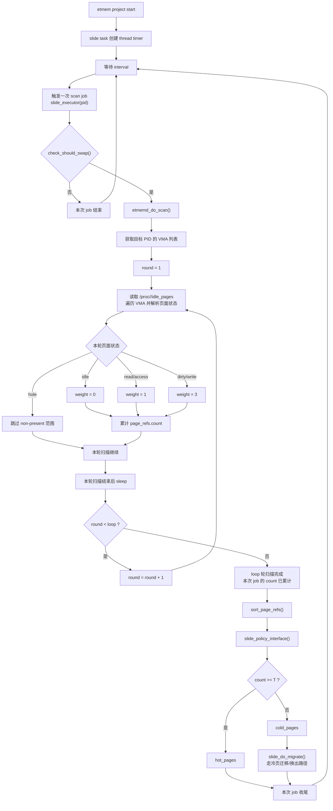
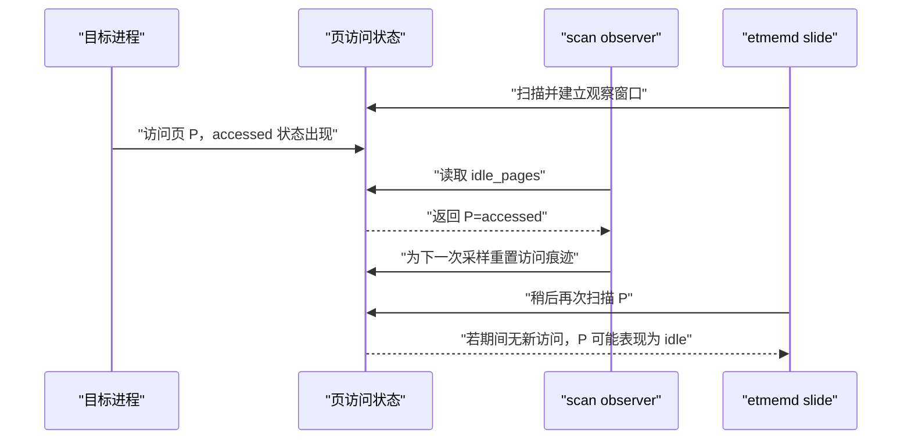

# etmemDemo

这是一个面向 openEuler etmem 的最小穿刺验证仓库，用来在上真实 VM / OpenClaw 之前，先回答两个问题：

1. 当前服务器的 etmem 扫描链路是否可用，能否观察某个进程的冷热内存分布。
2. 当前服务器的 etmem `slide` 换出链路是否可用，能否把冷匿名页换到 swap，从而降低进程 resident memory。

仓库包含四个入口：

- `etmem-cslide-hotness-demo`：真正走 `etmemd + cslide + etmem engine showtaskpages/showhostpages`，用于用 etmem 分析 VM/QEMU 实例的冷热温。
- `etmem-slide-monitor`：没有 AEP/SCM 时使用 `slide`，自动生成 etmem 配置、启动 etmemd、监控目标 PID 的 RSS/Swap，并可输出冷热占比诊断。
- `etmem-swap-demo`：启动 `etmemd` 和 `slide` 工程，把合成靶进程的冷匿名页换出，用 `VmRSS` / `VmSwap` / `MemAvailable` 验证效果。
- `etmem-scan-demo`：底层 fallback，只读 `/proc/<pid>/idle_pages`，不启动 `etmemd`，用于验证 etmem_scan 内核接口。

先澄清两个容易混淆的词：

- `sample` / `samples` 是“采样点/采样次数”。例如 `--samples 5` 或 `SCAN_SAMPLES=5` 表示 warmup 之后输出 5 次冷热扫描结果。
- scan-only demo 不需要 `/etc/etmem` 配置，也不调用 `etmem` 命令，它直接读 etmem 的内核接口 `/proc/<pid>/idle_pages`，只能算底层扫描 fallback。
- 要“用 etmem 分析冷热温”，请优先使用 `etmem-cslide-hotness-demo`。它会生成 `/etc/etmem` 配置，启动 `etmemd`，并调用 `etmem engine showtaskpages/showhostpages`。

官方背景参考：

- openEuler etmem 用户指南：<https://docs.openeuler.org/zh/docs/22.03_LTS_SP4/server/memory_storage/etmem/etmem_user_guide.html>
- etmem 仓库：<https://gitee.com/openeuler/etmem>

## 0. 适用范围

适合先做本机穿刺验证：

- 验证 openEuler 内核是否提供 `etmem_scan` / `etmem_swap`
- 验证 etmem 用户态工具 `etmem` / `etmemd` 是否能正常工作
- 在不触碰业务的情况下，确认“冷页识别”和“冷页换出”两条链路
- 对真实进程、QEMU 进程或 OpenClaw 实例做冷热观测

不直接证明生产收益：

- 合成 demo 不能替代真实业务压测
- swap 后端太慢时，内存下降可能伴随明显尾延迟
- 直接对 QEMU 进程做 swap 前，需要先确认热路径不会被换出

## 1. 从零开始准备服务器

在 openEuler 目标服务器上执行。

### 1.1 获取 demo

```bash
git clone https://github.com/HaotianChen616/etmemDemo.git
cd etmemDemo
```

如果服务器只能走 SSH：

```bash
git clone git@github.com:HaotianChen616/etmemDemo.git
cd etmemDemo
```

### 1.2 检查基础命令

```bash
python3 --version
uname -a
cat /etc/os-release
```

scan-only demo 只需要 `python3` 和内核 `/proc/<pid>/idle_pages` 接口。

swap demo 还需要：

```bash
command -v etmem
command -v etmemd
```

### 1.3 安装或编译 etmem 用户态工具

如果发行版仓库中已有包，优先使用包管理器：

```bash
sudo dnf install -y etmem || sudo yum install -y etmem
```

如果没有包，按 openEuler 官方文档从源码编译：

```bash
sudo yum -y install libboundscheck cmake gcc gcc-c++ make
git clone https://atomgit.com/openeuler/etmem.git
cd etmem
mkdir -p build
cd build
cmake ..
make
```

编译后需要确保 `etmem` 和 `etmemd` 在 `PATH` 中，或把二进制复制到服务器标准路径。

### 1.4 加载内核模块

```bash
sudo modprobe etmem_scan
sudo modprobe etmem_swap
lsmod | grep etmem
```

预期至少看到：

```text
etmem_scan
etmem_swap
```

如果只是跑 `etmem-scan-demo`，只需要 `etmem_scan`。如果跑 `etmem-swap-demo`，两个模块都需要。

### 1.5 检查 swap 后端

swap demo 必须启用 swap：

```bash
swapon --show
grep -E 'SwapTotal|SwapFree' /proc/meminfo
```

如果 `SwapTotal` 为 0，先配置 swap。测试优先使用 zram 或 NVMe swap，避免慢盘把结论变成 IO 抖动。

## 2. 第一阶段：用 etmem 分析 VM/QEMU 冷热温

如果目标是 VM/OpenClaw 实例，优先用 cslide hotness demo。它走的是完整 etmem 用户态链路：

```text
/etc/etmem config -> etmemd -> cslide -> showtaskpages/showhostpages
```

运行：

```bash
cd etmem-cslide-hotness-demo
sudo TARGET_PID=<QEMU_PID> NODE_PAIR=<AEP_NODE,DRAM_NODE> ./run_etmem_cslide_hotness_demo.sh
```

示例：

```bash
sudo TARGET_PID=12345 NODE_PAIR=2,0 SAMPLES=5 SAMPLE_INTERVAL_SEC=30 ./run_etmem_cslide_hotness_demo.sh
```

脚本默认 `NODE_MIG_QUOTA=0`，也就是先分析、不主动迁移。它会生成类似 `/etc/etmem/etmem-cslide-hotness-<pid>.conf` 的配置文件，然后执行：

```bash
etmemd -l 0 -s etmem_hotness_<script_pid>
etmem obj add -f /etc/etmem/etmem-cslide-hotness-<script_pid>.conf -s etmem_hotness_<script_pid>
etmem project start -n hotness_probe -s etmem_hotness_<script_pid>
etmem engine showtaskpages -t vm_hotness -n hotness_probe -e cslide -s etmem_hotness_<script_pid>
etmem engine showhostpages -n hotness_probe -e cslide -s etmem_hotness_<script_pid>
```

如果当前机器没有适合 cslide 的 VM hugepage / 分级内存环境，再使用下面的 `etmem_scan` 旁路观测。

## 3. 第二阶段：etmem_scan 旁路观测

这个阶段只读 `/proc/<pid>/idle_pages`。页面状态来自 etmem_scan，仓里的脚本负责把状态按 slide 风格累计成随时间变化的 hot/cold 占比。它不经过 `etmemd` 的 project 调度，也不等价于 slide 最终 swap 选页结果。

先跑合成靶进程，确认 raw scan 链路：

```bash
cd etmem-scan-demo
sudo ./run_etmem_scan_demo.sh
```

更强信号：

```bash
sudo TOTAL_MB=4096 HOT_MB=128 SCAN_INTERVAL_SEC=15 SCAN_SAMPLES=5 ./run_etmem_scan_demo.sh
```

如果想用接近 etmem slide 源码 `loop/sleep/interval/T` 的方式看随时间变化的冷热占比，可以直接跑：

```bash
sudo python3 ./scan_idle_pages.py \
  --pid <PID> \
  --warmup \
  --loop 3 \
  --sleep 10 \
  --interval 30 \
  --t 2 \
  --watch \
  --vma-filter slide-anon \
  --min-vma-kb 0 \
  --csv /tmp/etmem-scan-summary.csv
```

这表示每个样本内部扫描 3 轮；`sleep=10` 是轮内 scan 后等待，`interval=30` 是开始下一次扫描任务前的外层窗口；read/access 权重为 `1`，dirty/write 权重为 `3`，累计权重 `< 2` 判为 cold，`>= 2` 判为 hot。

预期现象：

- 输出中 `hot` 接近 `HOT_MB`
- `cold` 接近 `TOTAL_MB - HOT_MB`
- `cold_ratio` 稳定在较高水平
- 生成 summary CSV 和 per-VMA CSV

扫描真实进程：

```bash
sudo python3 ./scan_idle_pages.py \
  --pid <PID> \
  --warmup \
  --interval 30 \
  --samples 5 \
  --vma-filter slide-anon \
  --csv /tmp/etmem-scan-summary.csv \
  --vma-csv /tmp/etmem-scan-vmas.csv
```

扫描 QEMU / VM 进程可从这个参数组合开始：

```bash
sudo python3 ./scan_idle_pages.py \
  --pid <QEMU_PID> \
  --warmup \
  --interval 30 \
  --samples 5 \
  --vma-filter rw-private \
  --min-vma-kb 2048 \
  --csv /tmp/qemu-scan-summary.csv \
  --vma-csv /tmp/qemu-scan-vmas.csv
```

注意：读取 `idle_pages` 会清 accessed bit。`--warmup` 的作用是先清一次基线，再等待外层 `interval` 窗口，后续样本才更接近“这些扫描窗口内谁热、谁冷”。

### 3.1 slide 何时按 `T` 分冷热

`slide` 的 `count >= T` 判断发生在一次 scan job 的 `loop` 轮扫描完成之后，不是在每一轮 page scan 后立刻分级。

以当前 etmem 源码的 page scan 路径理解：

- `interval` 进入 task 的 thread timer，用于触发下一次 scan job。
- `loop` 是一次 scan job 内的扫描轮数。
- `sleep` 在一次 scan job 内每轮扫描后执行，包括最后一轮扫描后。
- 每轮从 `/proc/<pid>/idle_pages` 得到页面状态后，read/access 累计权重 `1`，dirty/write 累计权重 `3`，idle 累计权重 `0`。
- 这次 job 的 `loop` 轮都扫完后，`count >= T` 进入 hot pages，`count < T` 进入 cold pages，再把 cold pages 交给 slide 的迁移路径。
- `count` 是一次 job 内的累计值，不是进程生命周期内的永久访问计数。



例如：

```text
loop=3
sleep=10
interval=30
T=2
```

一次节奏可以看成：

```text
等待 interval=30s
  -> round 1 scan
  -> sleep 10s
  -> round 2 scan
  -> sleep 10s
  -> round 3 scan
  -> sleep 10s
  -> 按本次 job 的累计 count 和 T 分 hot/cold
  -> cold pages 进入 slide 迁移路径
```

### 3.2 为什么 `idle_pages` 不能并发扫同一 PID

读取 `/proc/<pid>/idle_pages` 不是只读展示一份静态报表，而是在做一次 etmem_scan 采样。它检查页面在当前观测窗口里的 accessed/dirty/idle 状态，并为后续窗口重置这类访问痕迹。

所以“会影响 accessed bit”的含义是：

- 影响的是后续扫描看到的冷热采样窗口，不是修改业务内存内容。
- 它不是把目标页内容逐页读一遍、把业务页读热。
- 单独运行本仓库的 scan observer 没问题；它自己通过 `warmup`、`interval`、`loop`、`sleep` 定义采样窗口。
- 要避免的是同一个 PID 同时被 `etmemd slide`、另一个 scan observer 或其他 `idle_pages` 读取者并发扫描。先读到访问痕迹的一方可能把这段痕迹消费掉，后读的一方会看到被切碎的窗口。



因此建议分两段做实验：

1. **冷热画像阶段**：只运行 scan observer，观察 hot/cold 占比和稳定性。
2. **slide 换出阶段**：关闭旁路冷热扫描，只看 `VmRSS`、`VmSwap`、major fault 和业务延迟。

## 4. 第三阶段：验证冷页换出

如果你已经有目标 PID，或者想让脚本启动目标进程后自动 attach，使用 slide monitor：

```bash
cd ../etmem-slide-monitor
sudo ./run_etmem_slide_monitor.sh \
  --pid <PID> \
  --loop 3 \
  --sleep 10 \
  --interval 30 \
  --t 2 \
  --sample-interval 30
```

让脚本启动目标进程：

```bash
sudo ./run_etmem_slide_monitor.sh \
  --loop 3 \
  --sleep 10 \
  --interval 30 \
  --t 2 \
  --duration 3600 \
  -- /path/to/your_app --arg1 --arg2
```

如果只想做合成冷页换出穿刺，再进入 swap demo：

回到仓库根目录或进入 swap demo：

```bash
cd ../etmem-swap-demo
sudo ./run_etmem_swap_demo.sh
```

更强信号：

```bash
sudo TOTAL_MB=4096 HOT_MB=128 DURATION_SEC=180 ./run_etmem_swap_demo.sh
```

如果希望按常规习惯把 etmem 配置文件放到 `/etc/etmem`，这样跑：

```bash
sudo CONFIG_DIR=/etc/etmem TOTAL_MB=4096 HOT_MB=128 DURATION_SEC=180 ./run_etmem_swap_demo.sh
```

说明：etmem 官方示例常把配置放在 `/etc/etmem`，但 `etmem obj add -f <config>` 接收的是配置文件路径，并不要求 demo 必须写死到 `/etc/etmem`。本仓库默认把配置写到 `/tmp/etmem-swap-demo.*/`，便于一次运行一个隔离工作目录；使用 `CONFIG_DIR=/etc/etmem` 时，脚本会把生成的 `etmem-demo-slide-<pid>.conf` 放到 `/etc/etmem`。

可选回读验证：

```bash
sudo REFAULT_AFTER=1 ./run_etmem_swap_demo.sh
```

预期通过条件：

- `VmRSS` 明显下降
- `VmSwap` 明显上升
- `MemAvailable` 通常回升
- 脚本输出 `PASS`

输出示例：

```text
before     rss=   1035 MB  vmswap=      0 MB  memavail=  64000 MB  swapfree=   8192 MB
running    rss=    160 MB  vmswap=    875 MB  memavail=  64870 MB  swapfree=   7317 MB
after      rss=    150 MB  vmswap=    885 MB  memavail=  64880 MB  swapfree=   7307 MB

PASS: etmem swapped cold anonymous pages and lowered target resident memory.
```

swap demo 实际执行的 etmem 配置类似这样，脚本运行时也会直接打印：

```ini
[project]
name=demo_slide
loop=3
interval=5
sleep=10
sysmem_threshold=100
swapcache_high_wmark=5
swapcache_low_wmark=3

[engine]
name=slide
project=demo_slide

[task]
project=demo_slide
engine=slide
name=coldmem_demo
type=pid
value=<coldmem_target_pid>
T=1
max_threads=1
swap_threshold=0g
swap_flag=no
```

脚本实际调用的 etmem 命令是：

```bash
etmemd -l 0 -s etmem_demo_<script_pid>
etmem obj add -f <generated_config_file> -s etmem_demo_<script_pid>
etmem project start -n demo_slide -s etmem_demo_<script_pid>
etmem project stop -n demo_slide -s etmem_demo_<script_pid>
etmem obj del -f <generated_config_file> -s etmem_demo_<script_pid>
```

## 5. 第四阶段：迁移到真实实例或 OpenClaw

建议按这个顺序做，不要直接上 swap：

1. 对 VM/OpenClaw 优先用 `etmem-cslide-hotness-demo`，观察 etmem 输出的冷热温。
2. 如果 cslide 不适用，再用 `etmem-scan-demo` 做底层 scan fallback。
3. 连续采样至少 5 到 10 个窗口，确认 cold ratio 稳定，而不是业务空闲假象。
4. 同时采集业务指标：QPS/FPS、p50/p95/p99、失败率、模型输出质量。
5. 如果冷数据集中在可接受的匿名缓冲区，再做小流量 swap 验证。
6. 先保守参数，确认没有明显 major fault 尖刺，再逐步扩大换出规模。

真实进程建议采集：

```bash
pid=<PID>
cat /proc/$pid/status | grep -E 'VmRSS|VmSwap'
cat /proc/$pid/smaps_rollup
pidstat -r -u -d -p $pid 5
vmstat 5
```

QEMU / VM 场景额外采集：

```bash
numastat -p <QEMU_PID>
grep -E 'AnonHugePages|Rss|Pss|Swap' /proc/<QEMU_PID>/smaps_rollup
```

## 6. 结果判定

cslide hotness 阶段通过：

- `etmemd` 能启动
- `etmem obj add` 和 `etmem project start` 成功
- `etmem engine showtaskpages` 能输出目标 task 页面访问情况
- 多轮采样能看到可解释的 hot / warm / cold 分布

raw scan fallback 阶段通过：

- `/proc/<pid>/idle_pages` 存在
- 合成 demo 能看到接近 `HOT_MB` 的热内存和接近 `TOTAL_MB - HOT_MB` 的冷内存
- 真实进程的 cold ratio 在业务负载期间稳定可解释

swap 阶段通过：

- `/proc/<pid>/swap_pages` 存在
- `etmemd` 能启动，`etmem obj add` 和 `project start` 成功
- 合成 demo 的 `VmRSS` 下降，`VmSwap` 上升
- 可选 `REFAULT_AFTER=1` 后 RSS 能回升，证明换出的页可正常 fault back

真实业务阶段通过：

- 内存收益达到预期，例如 DRAM/RSS 降低 15% 到 30%
- QPS/FPS 下降在可接受范围内
- p95/p99 没有持续尖刺
- `pswpin`、major fault 不在热路径持续增长

## 7. 常见问题

`/proc/<pid>/idle_pages` 不存在：

```bash
sudo modprobe etmem_scan
```

如果仍不存在，说明当前内核不包含 etmem scan 支持，或模块没有随内核安装。

`/proc/<pid>/swap_pages` 不存在：

```bash
sudo modprobe etmem_swap
```

如果仍不存在，无法跑 swap demo。

`command -v etmem` 失败：

先用包管理器安装，或按官方文档源码编译 etmem。

swap demo 没有 `VmSwap` 增长：

- 检查 `swapon --show`
- 检查 `etmem-swap-demo` 输出的 `etmem.log`
- 增大 `TOTAL_MB`
- 增大 `DURATION_SEC`
- 降低业务访问强度，确保目标页真的冷下来

RSS 降了但业务抖动：

- 换用 zram 或 NVMe swap
- 增大观测窗口，只换出更冷的页
- 对真实业务优先考虑 `MADV_SWAPFLAG` 方式标记可换出的内存区域
- 不要直接把模型权重、KV cache 或推理热路径内存纳入换出候选

## 8. 文件结构

```text
.
├── README.md
├── etmem-cslide-hotness-demo
│   ├── README.md
│   └── run_etmem_cslide_hotness_demo.sh
├── etmem-scan-demo
│   ├── README.md
│   ├── run_etmem_scan_demo.sh
│   └── scan_idle_pages.py
└── etmem-swap-demo
    ├── README.md
    ├── coldmem_target.py
    └── run_etmem_swap_demo.sh
```
